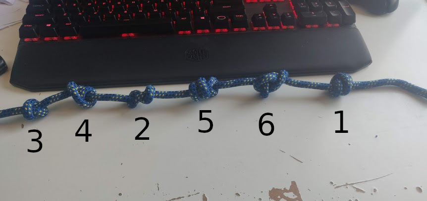
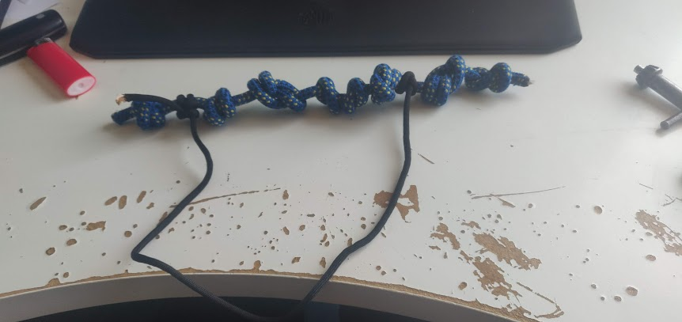

# KnotLang
### A language for those confined to rope
KnotLang is a programming language based on brainfuck. It's turing complete and can be written in knots using regular ropes. 

## Introduction
While I'm a pretty techy programmer guy my spare time is mostly spend in the outdoors. Mostly in a tent in the middle of nowhere with no reception. So also no pc in the vicinity. So what if I get a brilliant idea and I want to program it right away? Until now this was a serious problem but with the introduction of KnotLang I can program only with the use of a simple set of ropes.

## The language
The language is based on brainfuck and so the concept is similar. There is an memorybuffer of an x amount of bytes. There is also a pointer that points to the begin of the buffer at the start of the program. The memorybuffer is zero initialized. 

By the use of different commands the memorybuffer is modified. Looping is also possible in brainfuck with these commands but in KnotLang we do it a bit differently. on looping later on.

## The knots and what they do


This is not a knotting course so I will not be going into how to tie the knots. If you want to learn the knots wikipedia has great articles of them and the wikipedia names are used in this readme and the language.

We read KnotLang code from left to right. Every knot is it's own command.

### 1. barrelknot
If a barrelknot is encountered a byte is read from the input buffer. This byte is than put at the memory at the current pointer address.

### 2. eight
If an eight is encountered a byte is read from the memory at the pointer address. This byte is than appended to the output buffer. 

### 3. overhand 
If the next knot is the overhand knot the byte in the memory at the pointer is incremented by one. 

### 4. doubleoverhand 
If the next knot is the doubleoverhand knot the byte in the memory at the pointer is decremented by one. 

### 5. stevedore 
The stevedore knot indicates that the pointer has to be incremented by one. 

### 6. ashley 
The ashley knot indicates that the pointer has to be decremented by one. 

## Looping
Off course the language implements looping. This is done by, you guessed it, loops! If the interpreter encounters a clove hitch and the byte currently pointed to is bigger than 0 it will follow the rope until it is attached with a round turn and two half-hitches. The place of reconnection is where the program will continue. 

## Digital representation
Off course you want your programs to be run at a computer so you can use it for all kinds of real life applications. However this means that we need a way to write our code as text. 

For everything except loops we just put the names on each line. If we encounter a clove hitch that attaches to before the second knot we write it as:
`branch -> 2`

## An example
Lets write an simple program. A program that takes a variable and returns that variable times two. Offcourse we start in rope. This is what we get:



Off course we want to use the interpreter to run this code. If we convert it to text we get the following:

	barrelknot # Get a byte from the input buffer
	doubleoverhand # Decrease that byte by one
	stevedore # Move the pointer one up
	overhand # Increase the byte there by one
	overhand # Increase the byte again by one
	ashley # Go back one place in the memory.
	branch -> 2 # If the current byte is bigger than 0 jump to knot 2.
	stevedore # If it's not bigger than one we continue here and increment the pointer by one
	eight # Output the current byte at the pointer address to the output buffer.

Note that comments are currently not implemented in the interpreter.

## Using the interpreter
To use the interpreter we first have to read the text and pass it trough the interpreter:

``` python
with open('example.kl', 'r') as file:
	data = file.read()
	a = kl.read(data) # We pass a file to the reader
	if a.succeeded: # If the read is successful we continue 
		run = kl.run(a.value,[22],False) # We run the program with a list of input vars.
		if run.succeeded: # If it succeeds we continue.
			print(run.value.output) # Output the output buffer.
		else:
			print(run.value) # If running fails show error.
	else:
		print(a.value) # If reading fails show error
```
As seen above the program is read in two steps. First we validate the text and then we run it. The result of those two functions is a class which will tell you if it has succeeded. If so you can access it by the `value` member. 

The run function takes the validated text, an input buffer and if you want debug information.

## Debug information
The interpreter has errors build in that help you find incorrect code but it's still hard to find software bugs. For this there is a debug mode where it outputs debug information about the state before and after a knot is processed.

## Why are you writing functional code in python? Don't you know Haskell is a thing?
This project was created for a course at the University of Applied Sciences Utrecht. The goal of the assignment was to learn about the principles of functional programming. Because the goal was not to learn a new language python was used as a language. 
